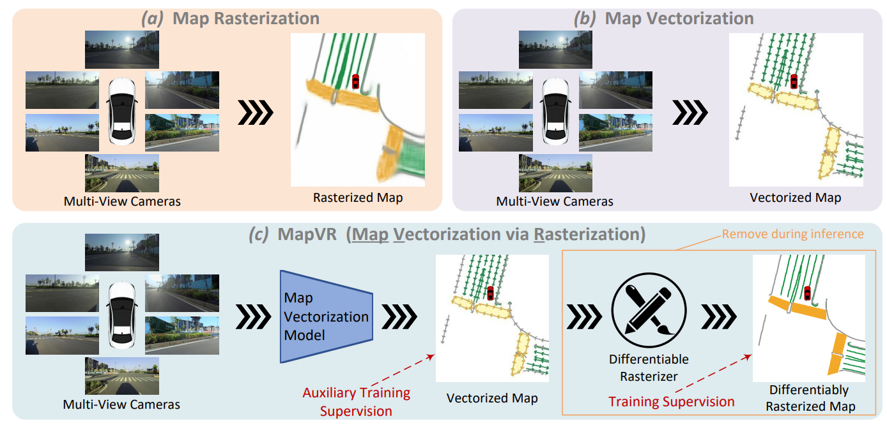

<div align="center">
<h1>MapVR </h1>
<h3>Online Map Vectorization for Autonomous Driving: A Rasterization Perspective</h3>


## Introduction
<div align="left">



Vectorized high-definition (HD) map is essential for autonomous driving, providing detailed and precise environmental information for advanced perception and planning. However, current map vectorization methods often exhibit deviations, and the existing evaluation metric for map vectorization lacks sufficient sensitivity to detect these deviations. To address these limitations, we propose integrating the philosophy of rasterization into map vectorization. Specifically, we introduce a new rasterization-based evaluation metric, which has superior sensitivity and is better suited to real-world autonomous driving scenarios. Furthermore, we propose MapVR (Map Vectorization via Rasterization), a novel framework that applies differentiable rasterization to vectorized outputs and then performs precise and geometry-aware supervision on rasterized HD maps. Notably, MapVR designs tailored rasterization strategies for various geometric shapes, enabling effective adaptation to a wide range of map elements. Experiments show that incorporating rasterization into map vectorization greatly enhances performance with no extra computational cost during inference, leading to more accurate map perception and ultimately promoting safer autonomous driving.


## Citation
If you find MapVR is useful in your research or applications, please consider giving us a star 🌟 and citing it by the following BibTeX entry.
```bibtex
@article{zhang2023online,
  title={Online Map Vectorization for Autonomous Driving: A Rasterization Perspective},
  author={Zhang, Gongjie and Lin, Jiahao and Wu, Shuang and Song, Yilin and Luo, Zhipeng and Xue, Yang and Lu, Shijian and Wang, Zuoguan},
  journal={arXiv preprint arXiv:2306.10502},
  year={2023}
}
```
